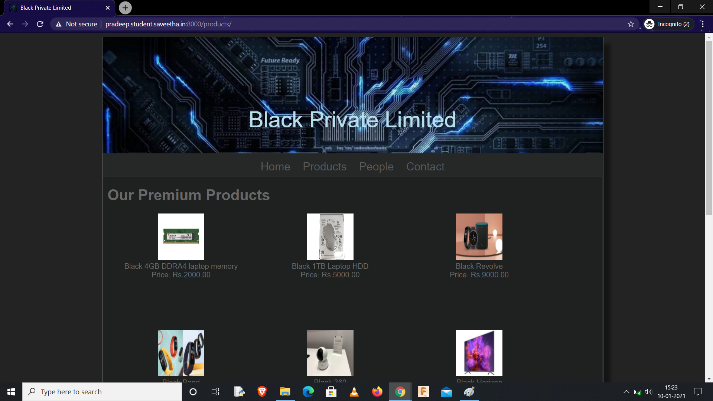
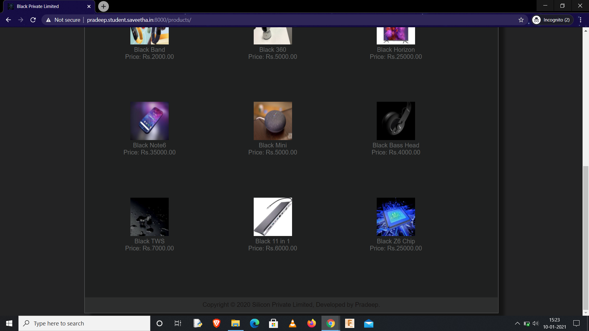
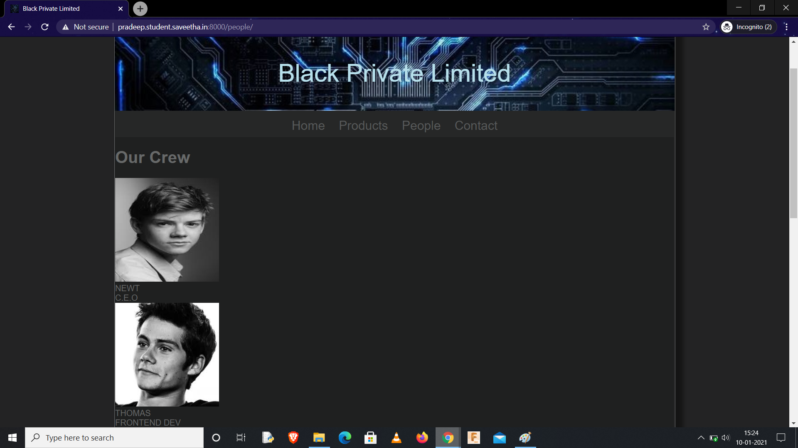

# Web Design for a Manufacturing Company
## AIM: 
To design a static website for a chip manufacturing company.

## DESIGN STEPS:
### Step 1: 
Requirement collection.
### Step 2:
Creating the layout using HTML and CSS.
### Step 3:
Updating the sample content.
### Step 4:
Choose the appropriate style and color scheme.
### Step 5:
Validate the layout in various browsers.
### Step 6:
Validate the HTML code.
### Step 6:
Publish the website in the given URL.

## PROGRAM:

### base.html
```

<!DOCTYPE html>
<html lang="en">

<head>
    <title>Black Private Limited</title>
    <link rel="stylesheet" href="">
    <link rel = "icon" href ="" type = "image/x-icon"> 
              
</head>

<body>
    <div class="container">
    <div class="banner">
        Black Private Limited
    </div>
    <div class="menu">
        <div class="menuitem"><a href="/home">Home</a></div> 
        <div class="menuitem"><a href="/products">Products</a></div>
        <div class="menuitem"><a href="/people">People</a></div> 
        <div class="menuitem"><a href="/contact">Contact</a></div> 
    </div><div class="content">
        
    
    </div>
    <div class="footer">
        Copyright © 2020 Silicon Private Limited, Developed by Pradeep.
    </div>
    </div>
</body>

</html>
```

### home.html
```



    <div class="homecontent">    
    <h1>About Us</h1>
    
    <div class="contenttext">
    Silicon Pvt Ltd, provides a broad range of semiconductor and infrastructure software applications that serve the data center, networking, software, broadband, wireless, and storage and industrial markets. Common applications for its products include: data center networking, home connectivity, broadband access, telecommunications equipment, smartphones, base stations, data center servers and storage, factory automation, power generation and alternative energy systems, displays, and mainframe operations and management, and application software development. Some of Silicon's core technologies and products include:
    <ul>
        <li>Memory Chips</li>
        <li>SATA HDD</li>
        <li>SATA SSD </li>
        <li>Broadband Modems</li>
        <li>Wifi Devices</li>
        <li>Switching Devices</li>
        <li>Optical Sensors</li>
    </ul> 
    </div>
    </div>

```
### products.html
```



    <div class="productcontent">    
    <h1>Our Premium Products</h1>
    <div class="productitems">
        <div class="productitem"> 
            <div class="itemimage">
            
            </div>
            <div class="itemname"> Black 4GB DDRA4 laptop memory</div>
            <div class="itemprice">Price: Rs.2000.00 </div>
        </div>
        <div class="productitem"> 
            <div class="itemimage">
            
            </div>
            <div class="itemname"> Black 1TB Laptop HDD</div>
            <div class="itemprice">Price: Rs.5000.00 </div>
        </div>
        <div class="productitem"> 
            <div class="itemimage">
            
            </div>
            <div class="itemname">Black Revolve</div>
            <div class="itemprice">Price: Rs.9000.00 </div>
        </div>
        <div class="productitem"> 
            <div class="itemimage">
            
            </div>
            <div class="itemname">Black Band</div>
            <div class="itemprice">Price: Rs.2000.00 </div>
        </div>
        <div class="productitem"> 
            <div class="itemimage">
            
            </div>
            <div class="itemname">Black 360</div>
            <div class="itemprice">Price: Rs.5000.00 </div>
        </div>
        <div class="productitem"> 
            <div class="itemimage">
            
            </div>
            <div class="itemname">Black Horizon</div>
            <div class="itemprice">Price: Rs.25000.00 </div>
        </div>
        <div class="productitem"> 
            <div class="itemimage">
            
            </div>
            <div class="itemname">Black Note6</div>
            <div class="itemprice">Price: Rs.35000.00 </div>
        </div>
        <div class="productitem"> 
            <div class="itemimage">
            
            </div>
            <div class="itemname">Black Mini</div>
            <div class="itemprice">Price: Rs.5000.00 </div>
        </div>
        <div class="productitem"> 
            <div class="itemimage">
            
            </div>
            <div class="itemname">Black Bass Head</div>
            <div class="itemprice">Price: Rs.4000.00 </div>
        </div>
        <div class="productitem"> 
            <div class="itemimage">
            
            </div>
            <div class="itemname">Black TWS</div>
            <div class="itemprice">Price: Rs.7000.00 </div>
        </div>
        <div class="productitem"> 
            <div class="itemimage">
            
            </div>
            <div class="itemname">Black 11 in 1</div>
            <div class="itemprice">Price: Rs.6000.00 </div>
        </div>
        <div class="productitem"> 
            <div class="itemimage">
            
            </div>
            <div class="itemname">Black Z6 Chip</div>
            <div class="itemprice">Price: Rs.25000.00 </div>
        </div>
    </div>
    </div>

```
### people.html:
```



<div class="peoplecontent">
    <h1>Our Crew</h1>
    <div class="crewmembers">
        <div class="crewmember">
            <div class="memberimage">
                
            </div>
            <div class="membername">NEWT</div>
            <div class="designation">C.E.O </div>
        </div>
        <div class="crewmember">
            <div class="memberimage">
                
            </div>
            <div >
            <div class="membername">THOMAS</div>
            <div class="designation">FRONTEND DEV</div>
        </div>
        <div class="crewmember">
            <div class="memberimage">
                
            </div>
            <div class="membername">GALLY</div>
            <div class="designation">TECHNICAL TEAM</div>
        </div>
        <div class="crewmember">
            <div class="memberimage">
                
            </div>
            <div class="membername">MINHO</div>
            <div class="designation"> R & D HEAD </div>
        </div>
        <div class="crewmember">
            <div class="memberimage">
                
            </div>
            <div class="membername">NOAH</div>
            <div class="designation"> DESIGN TEAM </div>
        </div>
        <div class="crewmember">
            <div class="memberimage">
                
            </div>
            <div class="membername">JANSON</div>
            <div class="designation"> MARKETING HEAD </div>
        </div>
    </div>
    
```
### contact.html:
```



    <div class="contactuscontent">
        <div class="contactbox">
            <div>
                
            </div>
        </div>
        <hr/>
        <div class="contactemail"><h1>Email: blackprivatelimited@gmail.com</h1></div>
        <div class="contactphone"><h2>Phone: +91-9159425427</h2></div>
        <div class="contactphone"><h2>Address: © Black pvt,Mountain View, California, United-States</h2></div>
        <hr/>
    </div>


```
## OUTPUT:









## CODE VALIDATION REPORT:


## RESULT:
Thus a website is designed for the chip manufacturing company and is hosted in the URL http://pradeep.student.saveetha.in:8000/. HTML code is validated.